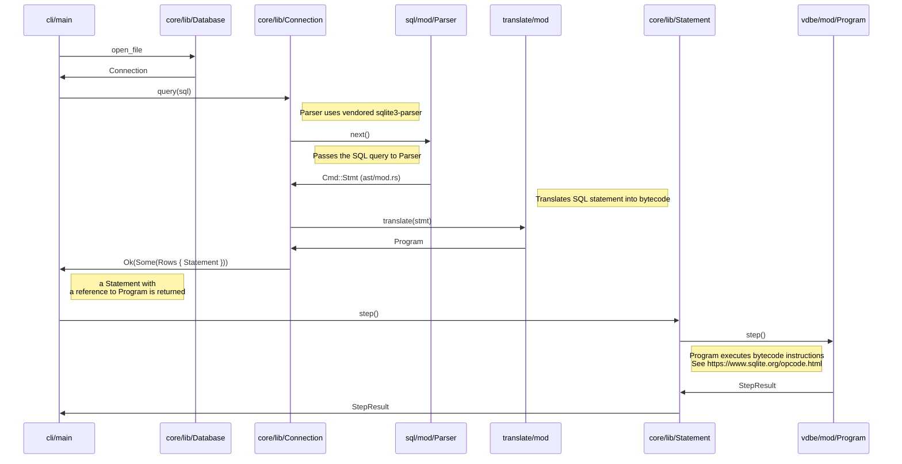

# Turso Database Manual

Welcome to Turso database manual!

## Table of contents

- [Turso Database Manual](#turso-database-manual)
  - [Table of contents](#table-of-contents)
  - [Introduction](#introduction)
    - [Getting Started](#getting-started)
    - [Limitations](#limitations)
  - [The SQL shell](#the-sql-shell)
    - [Shell commands](#shell-commands)
    - [Command line options](#command-line-options)
  - [The SQL language](#the-sql-language)
    - [`ALTER TABLE` — change table definition](#alter-table--change-table-definition)
    - [`BEGIN TRANSACTION` — start a transaction](#begin-transaction--start-a-transaction)
    - [`COMMIT TRANSACTION` — commit the current transaction](#commit-transaction--commit-the-current-transaction)
    - [`CREATE INDEX` — define a new index](#create-index--define-a-new-index)
    - [`CREATE TABLE` — define a new table](#create-table--define-a-new-table)
    - [`DELETE` - delete rows from a table](#delete---delete-rows-from-a-table)
    - [`DROP INDEX` - remove an index](#drop-index---remove-an-index)
    - [`DROP TABLE` — remove a table](#drop-table--remove-a-table)
    - [`END TRANSACTION` — commit the current transaction](#end-transaction--commit-the-current-transaction)
    - [`INSERT` — create new rows in a table](#insert--create-new-rows-in-a-table)
    - [`ROLLBACK TRANSACTION` — abort the current transaction](#rollback-transaction--abort-the-current-transaction)
    - [`SELECT` — retrieve rows from a table](#select--retrieve-rows-from-a-table)
    - [`UPDATE` — update rows of a table](#update--update-rows-of-a-table)
  - [JavaScript API](#javascript-api)
    - [Installation](#installation)
    - [Getting Started](#getting-started-1)
  - [SQLite C API](#sqlite-c-api)
    - [Basic operations](#basic-operations)
      - [`sqlite3_open`](#sqlite3_open)
      - [`sqlite3_prepare`](#sqlite3_prepare)
      - [`sqlite3_step`](#sqlite3_step)
      - [`sqlite3_column`](#sqlite3_column)
    - [WAL manipulation](#wal-manipulation)
      - [`libsql_wal_frame_count`](#libsql_wal_frame_count)
  - [Appendix A: Turso Internals](#appendix-a-turso-internals)
    - [Frontend](#frontend)
      - [Parser](#parser)
      - [Code generator](#code-generator)
      - [Query optimizer](#query-optimizer)
    - [Virtual Machine](#virtual-machine)
    - [MVCC](#mvcc)
    - [Pager](#pager)
    - [I/O](#io)
    - [References](#references)

## Introduction

Turso is an in-process relational database engine, aiming towards full compatibility with SQLite.

Unlike client-server database systems such as PostgreSQL or MySQL, which require applications to communicate over network protocols for SQL execution,
an in-process database is in your application memory space.
This embedded architecture eliminates network communication overhead, allowing for the best case of low read and write latencies in the order of sub-microseconds.

### Getting Started

You can install Turso on your computer as follows:

```
curl --proto '=https' --tlsv1.2 -LsSf \
  https://github.com/tursodatabase/turso/releases/latest/download/turso_cli-installer.sh | sh
```

Or alternatively, on MacOS, you can use Homebrew:

```
brew install turso
```

When you have the software installed, you can start a SQL shell as follows:

```console
$ tursodb
Turso
Enter ".help" for usage hints.
Connected to a transient in-memory database.
Use ".open FILENAME" to reopen on a persistent database
turso> SELECT 'hello, world';
hello, world
```

### Limitations

Turso aims towards full SQLite compatibility but has the following limitations:

* No multi-process access
* No multi-threading
* No savepoints
* No triggers
* No views
* No vacuum
* UTF-8 is the only supported character encoding

For more detailed list of SQLite compatibility, please refer to [COMPAT.md](../COMPAT.md).

## The SQL shell

The `tursodb` command provides an interactive SQL shell, similar to `sqlite3`. You can start it in in-memory mode as follows:

```console
$ tursodb
Turso
Enter ".help" for usage hints.
Connected to a transient in-memory database.
Use ".open FILENAME" to reopen on a persistent database
turso> SELECT 'hello, world';
hello, world
```

### Shell commands

The shell supports commands in addition to SQL statements. The commands start with a dot (".") followed by the command. The supported commands are:

| Command | Description |
|---------|-------------|
| `.schema` | Display the database schema |
| `.dump` | Dump database contents as SQL statements |

### Command line options

The SQL shell supports the following command line options:

| Option | Description |
|--------|-------------|
| `-m`, `--output-mode` `<mode>` | Configure output mode. Supported values for `<mode>`: <ul><li>`pretty` for pretty output (default)</li><li>`list` for minimal SQLite compatible format</li></ul>
| `-q`, `--quiet` | Don't display program information at startup |
| `-e`, `--echo` | Print commands before execution |
| `--readonly` | Open database in read-only mode |
| `-h`, `--help` | Print help |
| `-V`, `--version` | Print version |
| `--mcp` | Start a MCP server instead of the interactive shell |
| `--experimental-mvcc` | Enable experimental MVCC feature. **Note:**  the feature is not production ready so do not use it for critical data right now. |
| `--experimental-views` | Enable experimental views feature. **Note**: the feature is not production ready so do not use it for critical data right now. |

## The SQL language

### `ALTER TABLE` — change table definition

**Synopsis:**

```sql
ALTER TABLE old_name RENAME TO new_name

ALTER TABLE table_name ADD COLUMN column_name [ column_type ]

ALTER TABLE table_name DROP COLUMN column_name
```

**Example:**

```console
turso> CREATE TABLE t(x);
turso> .schema t;
CREATE TABLE t (x);
turso> ALTER TABLE t ADD COLUMN y TEXT;
turso> .schema t
CREATE TABLE t ( x , y TEXT );
turso> ALTER TABLE t DROP COLUMN y;
turso> .schema t
CREATE TABLE t ( x  );
```

### `BEGIN TRANSACTION` — start a transaction

**Synopsis:**

```sql
BEGIN [ transaction_mode ] [ TRANSACTION ]
```

where `transaction_mode` is one of the following:

* `DEFERRED`
* `IMMEDIATE`
* `EXCLUSIVE`

**See also:**

* [END TRANSACTION](#end-transaction--commit-the-current-transaction)

### `COMMIT TRANSACTION` — commit the current transaction

**Synopsis:**

```sql
COMMIT [ TRANSACTION ]
```

**See also:**

* [END TRANSACTION](#end-transaction--commit-the-current-transaction)

### `CREATE INDEX` — define a new index

> [!NOTE]  
> Indexes are currently experimental in Turso and not enabled by default.

**Synopsis:**

```sql
CREATE INDEX [ index_name ] ON table_name ( column_name )
```

**Example:**

```
turso> CREATE TABLE t(x);
turso> CREATE INDEX t_idx ON t(x);
```

### `CREATE TABLE` — define a new table

**Synopsis:**

```sql
CREATE TABLE table_name ( column_name [ column_type ], ... )
```

**Example:**

```console
turso> DROP TABLE t;
turso> CREATE TABLE t(x);
turso> .schema t
CREATE TABLE t (x);
```

### `DELETE` - delete rows from a table

**Synopsis:**

```sql
DELETE FROM table_name [ WHERE expression ]
```

**Example:**

```console
turso> DELETE FROM t WHERE x > 1;
```

### `DROP INDEX` - remove an index

> [!NOTE]  
> Indexes are currently experimental in Turso and not enabled by default.

**Example:**

```console
turso> DROP INDEX idx;
```

### `DROP TABLE` — remove a table

**Example:**

```console
turso> DROP TABLE t;
```

### `END TRANSACTION` — commit the current transaction

```sql
END [ TRANSACTION ]
```

**See also:**

* `COMMIT TRANSACTION`

### `INSERT` — create new rows in a table

**Synopsis:**

```sql
INSERT INTO table_name [ ( column_name, ... ) ] VALUES ( value, ... ) [, ( value, ... ) ...]
```

**Example:**

```
turso> INSERT INTO t VALUES (1), (2), (3);
turso> SELECT * FROM t;
┌───┐
│ x │
├───┤
│ 1 │
├───┤
│ 2 │
├───┤
│ 3 │
└───┘
```

### `ROLLBACK TRANSACTION` — abort the current transaction

```sql
ROLLBACK [ TRANSACTION ]
```

### `SELECT` — retrieve rows from a table

**Synopsis:**

```sql
SELECT expression
    [ FROM table-or-subquery ]
    [ WHERE condition ]
    [ GROU BY expression ]
```

**Example:**

```console
turso> SELECT 1;
┌───┐
│ 1 │
├───┤
│ 1 │
└───┘
turso> CREATE TABLE t(x);
turso> INSERT INTO t VALUES (1), (2), (3);
turso> SELECT * FROM t WHERE x >= 2;
┌───┐
│ x │
├───┤
│ 2 │
├───┤
│ 3 │
└───┘
```

### `UPDATE` — update rows of a table

**Synopsis:**

```sql
UPDATE table_name SET column_name = value [WHERE expression]
```

**Example:**

```console
turso> CREATE TABLE t(x);
turso> INSERT INTO t VALUES (1), (2), (3);
turso> SELECT * FROM t;
┌───┐
│ x │
├───┤
│ 1 │
├───┤
│ 2 │
├───┤
│ 3 │
└───┘
turso> UPDATE t SET x = 4 WHERE x >= 2;
turso> SELECT * FROM t;
┌───┐
│ x │
├───┤
│ 1 │
├───┤
│ 4 │
├───┤
│ 4 │
└───┘
```

## JavaScript API

Turso supports a JavaScript API, both with native and WebAssembly package options.

Please read the [JavaScript API reference](docs/javascript-api-reference.md) for more information.

### Installation

Installing the native package:

```console
npm i @tursodatabase/database
```

Installing the WebAssembly package:

```console
npm i @tursodatabase/database --cpu wasm32
```

### Getting Started

To use Turso from JavaScript application, you need to import `Database` type from the `@tursodatabase/database` package.
You can the prepare a statement with `Database.prepare` method and execute the SQL statement with `Statement.get()` method.

```
import { connect } from '@tursodatabase/database';

const db = await connect('turso.db');
const row = db.prepare('SELECT 1').get();
console.log(row);
```

## SQLite C API

Turso supports a subset of the SQLite C API, including libSQL extensions.

### Basic operations

#### `sqlite3_open` 

Open a connection to a database.

**Synopsis:**

```c
int sqlite3_open(const char *filename, sqlite3 **db_out);
int sqlite3_open_v2(const char *filename, sqlite3 **db_out, int _flags, const char *_z_vfs);
```

#### `sqlite3_prepare`

Prepare a SQL statement for execution.

**Synopsis:**

```c
int sqlite3_prepare_v2(sqlite3 *db, const char *sql, int _len, sqlite3_stmt **out_stmt, const char **_tail);
```

#### `sqlite3_step`

Evaluate a prepared statement until it yields the next row or completes.

**Synopsis:**

```c
int sqlite3_step(sqlite3_stmt *stmt);
```

#### `sqlite3_column`

Return the value of a column for the current row of a statement.

**Synopsis:**

```c
int sqlite3_column_type(sqlite3_stmt *_stmt, int _idx);
int sqlite3_column_count(sqlite3_stmt *_stmt);
const char *sqlite3_column_decltype(sqlite3_stmt *_stmt, int _idx);
const char *sqlite3_column_name(sqlite3_stmt *_stmt, int _idx);
int64_t sqlite3_column_int64(sqlite3_stmt *_stmt, int _idx);
double sqlite3_column_double(sqlite3_stmt *_stmt, int _idx);
const void *sqlite3_column_blob(sqlite3_stmt *_stmt, int _idx);
int sqlite3_column_bytes(sqlite3_stmt *_stmt, int _idx);
const unsigned char *sqlite3_column_text(sqlite3_stmt *stmt, int idx);
```

### WAL manipulation

#### `libsql_wal_frame_count`

Get the number of frames in the WAL.

**Synopsis:**

```c
int libsql_wal_frame_count(sqlite3 *db, uint32_t *p_frame_count);
```

**Description:**

The `libsql_wal_frame_count` function returns the number of frames in the WAL
in the `p_frame_count` parameter.

**Return Values:**

* `SQLITE_OK` if the number of frames in the WAL file is successfully returned.
* `SQLITE_MISUSE` if the `db` is NULL.
* SQLITE_ERROR if an error occurs while getting the number of frames in the WAL
  file.

**Safety Requirements:**

* The `db` parameter must be a valid pointer to a `sqlite3` database
  connection.
* The `p_frame_count` must be a valid pointer to a `u32` that will store the
* number of frames in the WAL file.

## Appendix A: Turso Internals

Turso's architecture resembles SQLite's but differs primarily in its
asynchronous I/O model. This asynchronous design enables applications to
leverage modern I/O interfaces like `io_uring,` maximizing storage device
performance. While an in-process database offers significant performance
advantages, integration with cloud services remains crucial for operations
like backups. Turso's asynchronous I/O model facilitates this by supporting
networked storage capabilities.

The high-level interface to Turso is the same as in SQLite:

* SQLite query language
* The `sqlite3_prepare()` function for translating SQL statements to programs
  ("prepared statements")
* The `sqlite3_step()` function for executing programs

If we start with the SQLite query language, you can use the `turso`
command, for example, to evaluate SQL statements in the shell:

```
turso> SELECT 'hello, world';
hello, world
```

To execute this SQL statement, the shell uses the `sqlite3_prepare()`
interface to parse the statement and generate a bytecode program, a step
called preparing a statement. When a statement is prepared, it can be executed
using the `sqlite3_step()` function.

To illustrate the different components of Turso, we can look at the sequence
diagram of a query from the CLI to the bytecode virtual machine (VDBE):



To drill down into more specifics, we inspect the bytecode program for a SQL
statement using the `EXPLAIN` command in the shell. For our example SQL
statement, the bytecode looks as follows:

```
turso> EXPLAIN SELECT 'hello, world';
addr  opcode             p1    p2    p3    p4             p5  comment
----  -----------------  ----  ----  ----  -------------  --  -------
0     Init               0     4     0                    0   Start at 4
1     String8            0     1     0     hello, world   0   r[1]='hello, world'
2     ResultRow          1     1     0                    0   output=r[1]
3     Halt               0     0     0                    0
4     Transaction        0     0     0                    0
5     Goto               0     1     0                    0
```

The instruction set of the virtual machine consists of domain specific
instructions for a database system. Every instruction consists of an
opcode that describes the operation and up to 5 operands. In the example
above, execution starts at offset zero with the `Init` instruction. The
instruction sets up the program and branches to a instruction at address
specified in operand `p2`. In our example, address 4 has the
`Transaction` instruction, which begins a transaction. After that, the
`Goto` instruction then branches to address 1 where we load a string
constant `'hello, world'` to register `r[1]`. The `ResultRow` instruction
produces a SQL query result using contents of `r[1]`. Finally, the
program terminates with the `Halt` instruction.

### Frontend

#### Parser

The parser is the module in the front end that processes SQLite query language input data, transforming it into an abstract syntax tree (AST) for further processing. The parser is an in-tree fork of [lemon-rs](https://github.com/gwenn/lemon-rs), which in turn is a port of SQLite parser into Rust. The emitted AST is handed over to the code generation steps to turn the AST into virtual machine programs.

#### Code generator

The code generator module takes AST as input and produces virtual machine programs representing executable SQL statements. At high-level, code generation works as follows:

1. `JOIN` clauses are transformed into equivalent `WHERE` clauses, which simplifies code generation.
2. `WHERE` clauses are mapped into bytecode loops
3. `ORDER BY` causes the bytecode program to pass result rows to a sorter before returned to the application.
4. `GROUP BY` also causes the bytecode programs to pass result rows to an aggregation function before results are returned to the application.
  
#### Query optimizer

TODO

### Virtual Machine

TODO

### MVCC

The database implements a multi-version concurrency control (MVCC) using a hybrid architecture that combines an in-memory index with persistent storage through WAL (Write-Ahead Logging) and SQLite database files. The implementation draws from the Hekaton approach documented in Larson et al. (2011), with key modifications for durability handling.

The database maintains a centralized in-memory MVCC index that serves as the primary coordination point for all database connections. This index provides shared access across all active connections and stores the most recent versions of modified data. It implements version visibility rules for concurrent transactions following the Hekaton MVCC design. The architecture employs a three-tier storage hierarchy consisting of the MVCC index in memory as the primary read/write target for active transactions, a page cache in memory serving as an intermediate buffer for data retrieved from persistent storage, and persistent storage comprising WAL files and SQLite database files on disk.

_Read operations_ follow a lazy loading strategy with a specific precedence order. The database first queries the in-memory MVCC index to check if the requested row exists and is visible to the current transaction. If the row is not found in the MVCC index, the system performs a lazy read from the page cache. When necessary, the page cache retrieves data from both the WAL and the underlying SQLite database file.

_Write operations_ are handled entirely within the in-memory MVCC index during transaction execution. This design provides high-performance writes with minimal latency, immediate visibility of changes within the transaction scope, and isolation from other concurrent transactions until the transaction is committed.

_Commit operation_ ensures durability through a two-phase approach: first, the system writes the complete transaction write set from the MVCC index to the page cache, then the page cache contents are flushed to the WAL, ensuring durable storage of the committed transaction. This commit protocol guarantees that once a transaction commits successfully, all changes are persisted to durable storage and will survive system failures.

While the implementation follows Hekaton's core MVCC principles, it differs in one significant aspect regarding logical change tracking. Unlike Hekaton, this system does not maintain a record of logical changes after flushing data to the WAL. This design choice simplifies compatibility with the SQLite database file format.

### Pager

TODO

### I/O

Every I/O operation shall be tracked by a corresponding `Completion`. A `Completion` is just an object that tracks a particular I/O operation. The database `IO` will call it's complete callback to signal that the operation was complete, thus ensuring that every tracker can be poll to see if the operation succeeded.


To advance the Program State Machines, you must first wait for the tracked completions to complete. This can be done either by busy polling (`io.wait_for_completion`) or polling once and then yielding - e.g

  ```rust
  if !completion.is_completed {
    return StepResult::IO;
  }
  ```

This allows us to be flexible in places where we do not have the state machines in place to correctly return the Completion. Thus, we can block in certain places to avoid bigger refactorings, which opens up the opportunity for such refactorings in separate PRs.

To know if a function does any sort of I/O we just have to look at the function signature. If it returns `Completion`, `Vec<Completion>` or `IOResult`, then it does I/O.

The `IOResult` struct looks as follows:
  ```rust
  pub enum IOCompletions {
    Single(Arc<Completion>),
    Many(Vec<Arc<Completion>>),
  }

  #[must_use]
  pub enum IOResult<T> {
    Done(T),
    IO(IOCompletions),
  }
  ```

This implies that when a function returns an `IOResult`, it must be called again until it returns an `IOResult::Done` variant. This works similarly to how `Future`s are polled in rust. When you receive a `Poll::Ready(None)`, it means that the future stopped it's execution. In a similar vein, if we receive `IOResult::Done`, the function/state machine has reached the end of it's execution. `IOCompletions` is here to signal that, if we are executing any I/O operation, that we need to propagate the completions that are generated from it. This design forces us to handle the fact that a function is asynchronous in nature. This is essentially [function coloring](https://www.tedinski.com/2018/11/13/function-coloring.html), but done at the application level instead of the compiler level.

### References

Per-Åke Larson et al. "High-Performance Concurrency Control Mechanisms for Main-Memory Databases." In _VLDB '11_

[SQLite]: https://www.sqlite.org/

## Appendix B: SQL over HTTP Protocol Specification

The SQL over HTTP protocol enables remote SQL execution for Turso databases via HTTP requests. This specification documents a stateless yet stream-aware protocol for executing SQL statements over HTTP with JSON encoding.

### Overview

SQL over HTTP provides a way to execute SQL statements remotely using standard HTTP requests and responses. Unlike traditional database connections, HTTP is stateless, but the protocol maintains stream state using an opaque baton mechanism similar to session cookies.

Key characteristics:
- **Stateless Transport**: Each HTTP request is independent
- **Stateful Sessions**: Stream state maintained via baton exchange
- **Stream Serialization**: Requests on the same stream must be processed serially
- **Automatic Cleanup**: Abandoned streams are closed after inactivity timeout

### Protocol Endpoints

The protocol defines several HTTP endpoints for different operations:

#### Version Check
```
GET /v3
```
Returns 2xx response if the server supports SQL over HTTP protocol version 3 with JSON encoding.

#### Pipeline Execution
```
POST /v3/pipeline
Content-Type: application/json
Authorization: Bearer <jwt-token>
```
Executes a pipeline of SQL operations on a stream.

#### Cursor Execution  
```
POST /v3/cursor
Content-Type: application/json
Authorization: Bearer <jwt-token>
```
Executes a batch of statements using a streaming cursor for incremental result processing.

### Authentication

The protocol supports JWT-based authentication using the `Authorization` header:
```
Authorization: Bearer <jwt-token>
```

### Stream Management

#### Baton Mechanism
Streams are identified and managed using an opaque baton value exchanged between client and server:

- **New Stream**: Client sends `baton: null` to create a new stream
- **Existing Stream**: Client includes the baton from the previous response
- **Stream Closure**: Server returns `baton: null` to indicate stream closure
- **Sticky Routing**: Server may return `base_url` to direct future requests

#### Request Format
```typescript
{
  "baton": string | null,
  "requests": Array<StreamRequest>
}
```

#### Response Format
```typescript
{
  "baton": string | null,
  "base_url": string | null,
  "results": Array<StreamResult>
}
```

### Request Types

#### Execute Statement
Executes a single SQL statement:

```typescript
{
  "type": "execute",
  "stmt": {
    "sql": "SELECT * FROM users WHERE id = ?",
    "args": [{"type": "integer", "value": "123"}],
    "named_args": [],
    "want_rows": true
  }
}
```

#### Execute Batch
Executes multiple SQL statements with conditional execution:

```typescript
{
  "type": "batch", 
  "batch": {
    "steps": [
      {
        "condition": {"type": "ok", "step": 0},
        "stmt": {
          "sql": "INSERT INTO users (name) VALUES (?)",
          "args": [{"type": "text", "value": "Alice"}],
          "named_args": [],
          "want_rows": false
        }
      }
    ]
  }
}
```

#### Execute Sequence
Executes multiple SQL statements separated by semicolons:

```typescript
{
  "type": "sequence",
  "sql": "CREATE TABLE test (id INTEGER); INSERT INTO test VALUES (1);"
}
```

#### Describe Statement
Gets metadata about a SQL statement:

```typescript
{
  "type": "describe", 
  "sql": "SELECT * FROM users"
}
```

#### Close Stream
Explicitly closes the current stream:

```typescript
{
  "type": "close"
}
```

#### Get Autocommit State
Checks if the stream is in autocommit mode:

```typescript
{
  "type": "get_autocommit"
}
```

### Data Types

Values are encoded using a tagged union structure:

```typescript
type Value = 
  | { "type": "null" }
  | { "type": "integer", "value": string }  // 64-bit integer as string
  | { "type": "float", "value": number }
  | { "type": "text", "value": string }
  | { "type": "blob", "base64": string }    // Base64-encoded binary data
```

### Results

#### Statement Results
```typescript
{
  "type": "execute",
  "result": {
    "cols": [
      {"name": "id", "decltype": "INTEGER"},
      {"name": "name", "decltype": "TEXT"}
    ],
    "rows": [
      [{"type": "integer", "value": "1"}, {"type": "text", "value": "Alice"}]
    ],
    "affected_row_count": 1,
    "last_insert_rowid": "1"
  }
}
```

#### Batch Results  
```typescript
{
  "type": "batch",
  "result": {
    "step_results": [/* StmtResult | null */],
    "step_errors": [/* Error | null */]
  }
}
```

#### Describe Results
```typescript
{
  "type": "describe",
  "result": {
    "params": [{"name": "?1"}],
    "cols": [{"name": "id", "decltype": "INTEGER"}],
    "is_explain": false,
    "is_readonly": true
  }
}
```

### Cursor Streaming

The cursor endpoint supports streaming large result sets:

#### Cursor Request
```typescript
{
  "baton": string | null,
  "batch": {
    "steps": [/* batch steps */]
  }
}
```

#### Cursor Response
The response is a stream of newline-delimited JSON:
```
{"baton": "...", "base_url": null}
{"type": "step_begin", "step": 0, "cols": [...]}
{"type": "row", "row": [...]}
{"type": "step_end", "affected_row_count": 1}
```

#### Cursor Entry Types
- `step_begin`: Start of statement execution with column metadata
- `row`: Individual result row  
- `step_end`: End of statement with execution statistics
- `step_error`: Statement execution error
- `error`: Batch execution error

### Error Handling

Errors are returned in a consistent format:

```typescript
{
  "type": "error",
  "error": {
    "message": "Table 'users' doesn't exist",
    "code": "SQLITE_ERROR"
  }
}
```

HTTP-level errors (4xx/5xx) indicate the stream is no longer valid and should be recreated.

### Batch Conditions

Conditional execution in batches is supported:

```typescript
type BatchCondition = 
  | {"type": "ok", "step": number}          // Previous step succeeded
  | {"type": "error", "step": number}       // Previous step failed  
  | {"type": "not", "cond": BatchCondition} // Logical NOT
  | {"type": "and", "conds": BatchCondition[]} // Logical AND
  | {"type": "or", "conds": BatchCondition[]}  // Logical OR
  | {"type": "is_autocommit"}               // Stream is in autocommit mode
```

### Example Session

```bash
# 1. Create new stream and execute statement
curl -X POST https://db.turso.io/v3/pipeline \
  -H "Authorization: Bearer ${TOKEN}" \
  -H "Content-Type: application/json" \
  -d '{
    "baton": null,
    "requests": [{
      "type": "execute",
      "stmt": {
        "sql": "SELECT COUNT(*) FROM users",
        "args": [],
        "named_args": [], 
        "want_rows": true
      }
    }]
  }'

# Response:
{
  "baton": "abc123...",
  "base_url": null,
  "results": [{
    "type": "ok",
    "response": {
      "type": "execute", 
      "result": {
        "cols": [{"name": "COUNT(*)", "decltype": ""}],
        "rows": [[{"type": "integer", "value": "5"}]],
        "affected_row_count": 0,
        "last_insert_rowid": null
      }
    }
  }]
}

# 2. Continue on same stream  
curl -X POST https://db.turso.io/v3/pipeline \
  -H "Authorization: Bearer ${TOKEN}" \
  -H "Content-Type: application/json" \
  -d '{
    "baton": "abc123...",
    "requests": [{"type": "close"}]
  }'
```

### Implementation Notes

- Servers must ensure baton values are unpredictable and unforgeable
- Stream requests must be processed serially for consistency  
- Abandoned streams should timeout after reasonable inactivity period
- The protocol supports forward compatibility through unknown field tolerance
- Base64 encoding is used for binary blob data in JSON
- Integer values are encoded as strings to preserve 64-bit precision
