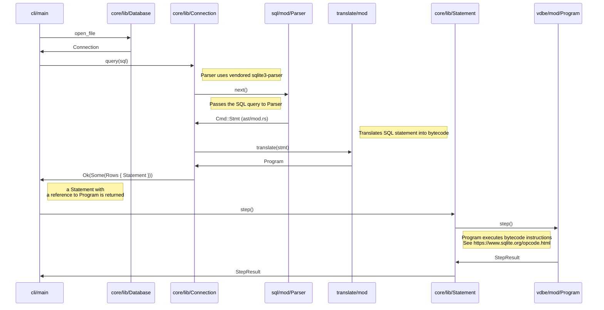

# Turso Database Manual

Welcome to Turso database manual!

## Table of contents

- [Turso Database Manual](#turso-database-manual)
  - [Table of contents](#table-of-contents)
  - [Introduction](#introduction)
    - [Getting Started](#getting-started)
    - [Limitations](#limitations)
  - [Transactions](#transactions)
    - [Deferred transaction lifecycle](#deferred-transaction-lifecycle)
  - [The SQL shell](#the-sql-shell)
    - [Shell commands](#shell-commands)
    - [Command line options](#command-line-options)
  - [The SQL language](#the-sql-language)
    - [`ALTER TABLE` — change table definition](#alter-table--change-table-definition)
    - [`BEGIN TRANSACTION` — start a transaction](#begin-transaction--start-a-transaction)
    - [`COMMIT TRANSACTION` — commit the current transaction](#commit-transaction--commit-the-current-transaction)
    - [`CREATE INDEX` — define a new index](#create-index--define-a-new-index)
    - [`CREATE TABLE` — define a new table](#create-table--define-a-new-table)
    - [`DELETE` - delete rows from a table](#delete---delete-rows-from-a-table)
    - [`DROP INDEX` - remove an index](#drop-index---remove-an-index)
    - [`DROP TABLE` — remove a table](#drop-table--remove-a-table)
    - [`END TRANSACTION` — commit the current transaction](#end-transaction--commit-the-current-transaction)
    - [`INSERT` — create new rows in a table](#insert--create-new-rows-in-a-table)
    - [`ROLLBACK TRANSACTION` — abort the current transaction](#rollback-transaction--abort-the-current-transaction)
    - [`SELECT` — retrieve rows from a table](#select--retrieve-rows-from-a-table)
    - [`UPDATE` — update rows of a table](#update--update-rows-of-a-table)
  - [JavaScript API](#javascript-api)
    - [Installation](#installation)
    - [Getting Started](#getting-started-1)
  - [SQLite C API](#sqlite-c-api)
    - [Basic operations](#basic-operations)
      - [`sqlite3_open`](#sqlite3_open)
      - [`sqlite3_prepare`](#sqlite3_prepare)
      - [`sqlite3_step`](#sqlite3_step)
      - [`sqlite3_column`](#sqlite3_column)
    - [WAL manipulation](#wal-manipulation)
      - [`libsql_wal_frame_count`](#libsql_wal_frame_count)
  - [Journal Mode](#journal-mode)
  - [Encryption](#encryption)
  - [Vector search](#vector-search)
  - [Full-Text Search](#full-text-search-experimental)
  - [CDC](#cdc-early-preview)
  - [Index Method](#index-method-experimental)
  - [Appendix A: Turso Internals](#appendix-a-turso-internals)
    - [Frontend](#frontend)
      - [Parser](#parser)
      - [Code generator](#code-generator)
      - [Query optimizer](#query-optimizer)
    - [Virtual Machine](#virtual-machine)
    - [MVCC](#mvcc)
    - [Pager](#pager)
    - [I/O](#io)
    - [Encryption](#encryption-1)
    - [References](#references)

## Introduction

Turso is an in-process relational database engine, aiming towards full compatibility with SQLite.

Unlike client-server database systems such as PostgreSQL or MySQL, which require applications to communicate over network protocols for SQL execution,
an in-process database is in your application memory space.
This embedded architecture eliminates network communication overhead, allowing for the best case of low read and write latencies in the order of sub-microseconds.

### Getting Started

You can install Turso on your computer as follows:

```
curl --proto '=https' --tlsv1.2 -LsSf \
  https://github.com/tursodatabase/turso/releases/latest/download/turso_cli-installer.sh | sh
```


```
brew install turso
```

When you have the software installed, you can start a SQL shell as follows:

```console
$ tursodb
Turso
Enter ".help" for usage hints.
Connected to a transient in-memory database.
Use ".open FILENAME" to reopen on a persistent database
turso> SELECT 'hello, world';
hello, world
```

### Limitations

Turso aims towards full SQLite compatibility but has the following limitations:

* Query result ordering is not guaranteed to be the same (see [#2964](https://github.com/tursodatabase/turso/issues/2964) for more discussion)
* No multi-process access
* No multi-threading
* No savepoints
* No triggers
* No views
* No vacuum
* UTF-8 is the only supported character encoding

For more detailed list of SQLite compatibility, please refer to [COMPAT.md](../COMPAT.md).

#### MVCC limitations

The MVCC implementation is experimental and has the following limitations:

* Indexes cannot be created and databases with indexes cannot be used.
* All the data is eagerly loaded from disk to memory on first access so using big databases may take a long time to start, and will consume a lot of memory
* Only `PRAGMA wal_checkpoint(TRUNCATE)` is supported and it blocks both readers and writers
* Many features may not work, work incorrectly, and/or cause a panic.
* Queries may return incorrect results
* If a database is written to using MVCC and then opened again without MVCC, the changes are not visible unless first checkpointed

## The SQL shell

The `tursodb` command provides an interactive SQL shell, similar to `sqlite3`. You can start it in in-memory mode as follows:

```console
$ tursodb
Turso
Enter ".help" for usage hints.
Connected to a transient in-memory database.
Use ".open FILENAME" to reopen on a persistent database
turso> SELECT 'hello, world';
hello, world
```

### Shell commands

The shell supports commands in addition to SQL statements. The commands start with a dot (".") followed by the command. The supported commands are:

| Command | Description |
|---------|-------------|
| `.schema` | Display the database schema |
| `.dump` | Dump database contents as SQL statements |

### Command line options

The SQL shell supports the following command line options:

| Option | Description |
|--------|-------------|
| `-m`, `--output-mode` `<mode>` | Configure output mode. Supported values for `<mode>`: <ul><li>`pretty` for pretty output (default)</li><li>`list` for minimal SQLite compatible format</li></ul>
| `-q`, `--quiet` | Don't display program information at startup |
| `-e`, `--echo` | Print commands before execution |
| `--readonly` | Open database in read-only mode |
| `-h`, `--help` | Print help |
| `-V`, `--version` | Print version |
| `--mcp` | Start a MCP server instead of the interactive shell |
| `--experimental-encryption` | Enable experimental encryption at rest feature. **Note:** the feature is not production ready so do not use it for critical data right now. |
| `--experimental-strict` | Enable experimental strict schema feature. **Note**: the feature is not production ready so do not use it for critical data right now. |
| `--experimental-views` | Enable experimental views feature. **Note**: the feature is not production ready so do not use it for critical data right now. |

## Transactions

A transaction is a sequence of one or more SQL statements that execute as a single, atomic unit of work.
A transaction ensures **atomicity** and **isolation**, meaning that either all SQL statements are executed or none of them are, and that concurrent transactions don't interfere with other transactions.
Transactions maintain database integrity in the presence of errors, crashes, and concurrent access.

Each connection can have exactly one active transaction at a time. All statements prepared on a connection belong to the same transaction context. You cannot interleave statement execution across different transactions on a single connection. When you need concurrency (including `BEGIN CONCURRENT`), you need to use *different connections*, not parallel statements within the same connection.

Turso supports three types of transactions: **deferred**, **immediate**, and **concurrent** transactions:

* **Deferred (default)**: The transaction begins in a suspended state and does not acquire locks immediately. It starts a read transaction when the first read SQL statement (e.g., `SELECT`) runs, and upgrades to a write transaction only when the first write SQL statement (e.g., `INSERT`, `UPDATE`, `DELETE`) executes. This mode allows concurrency for reads and delays write locks, which can reduce contention.
* **Immediate**: The transaction starts immediately with a reserved write lock, preventing other write transactions from starting concurrently but allowing reads. It attempts to acquire the write lock right away on the `BEGIN` statement, which can fail if another write transaction exists. The `EXCLUSIVE` mode is always an alias for `IMMEDIATE` in Turso, just like it is in SQLite in WAL mode.
* **Concurrent (MVCC only)**: The transaction begins immediately and allows multiple concurrent read and write transactions. When a concurrent transaction commits, the database performs row-level conflict detection and returns a `SQLITE_BUSY` (write-write conflict) error if the transaction attempted to modify a row that was concurrently modified by another transaction. This mode provides the highest level of concurrency at the cost of potential transaction conflicts that must be retried by the application. The transaction isolation level provided by concurrent transactions is snapshot isolation.

### Deferred transaction lifecycle

When the `BEGIN DEFERRED TRANSACTION` statement executes, the database acquires no snapshot or locks. Instead, the transaction is in a suspended state until the first read or write SQL statement executes. When the first read statement executes, a read transaction begins. The database allows multiple read transactions to exist concurrently. When the first write statement executes, a read transaction is either upgraded to a write transaction or a write transaction begins. The database allows a single write transaction at a time. Concurrent write transactions fail with `SQLITE_BUSY` error.

If a deferred transaction remains unused (no reads or writes), it is automatically restarted by the database if another write transaction commits before the transaction is used. However, if the deferred transaction has already performed reads and another concurrent write transaction commits, it cannot automatically restart due to potential snapshot inconsistency. In this case, the deferred transaction must be manually rolled back and restarted by the application.

### Concurrent transaction lifecycle

Concurrent transactions are only available when MVCC (Multi-Version Concurrency Control) is enabled in the database. They use optimistic concurrency control to allow multiple transactions to modify the database simultaneously.

When the `BEGIN CONCURRENT TRANSACTION` statement executes, the database:

1. Assigns a unique transaction ID to the transaction
2. Records a begin timestamp from the logical clock
3. Creates an empty read set and write set to track accessed rows
4. Does **not** acquire any locks

Unlike deferred transactions which delay locking, concurrent transactions never acquire locks. Instead, they rely on MVCC's snapshot isolation and conflict detection at commit time.

#### Read snapshot isolation

Each concurrent transaction reads from a consistent snapshot of the database as of its begin timestamp. This means:

- Reads see all data committed before the transaction's begin timestamp
- Reads do **not** see writes from other transactions that commit after this transaction starts
- Reads from the same transaction are consistent (repeatable reads within the transaction)
- Multiple concurrent transactions can read and write simultaneously without blocking each other

All rows read by the transaction are tracked in the transaction's read set, and all rows written are tracked in the write set.

#### Commit and conflict detection

When a concurrent transaction commits, the database performs these steps:

1. **Exclusive transaction check**: If there is an active exclusive transaction (started with `BEGIN IMMEDIATE` or a `BEGIN DEFERRED` that upgraded to a write transaction), the concurrent transaction **cannot commit** and receives a `SQLITE_BUSY` error. Concurrent transactions can read and write concurrently with exclusive transactions, but cannot commit until the exclusive transaction completes.

2. **Write-write conflict detection**: For each row in the transaction's write set, the database checks if the row was modified by another transaction. A write-write conflict occurs when:
   - The row is currently being modified by another active transaction, or
   - The row was modified by a transaction that committed after this transaction's begin timestamp

3. **Commit or abort**: If no conflicts are detected, the transaction commits successfully. All row versions in the write set have their begin timestamps updated to the transaction's commit timestamp, making them visible to future transactions. If a conflict is detected, the transaction fails with a `SQLITE_BUSY` error and must be rolled back and retried by the application.

#### Interaction with exclusive transactions

Concurrent transactions can coexist with exclusive transactions (deferred and immediate), but with important restrictions:

- **Concurrent transactions can read and write** while an exclusive transaction is active
- **Concurrent transactions cannot commit** while an exclusive transaction holds the exclusive lock
- **Exclusive transactions block concurrent transaction commits**, not their reads or writes

This design allows concurrent transactions to make progress during an exclusive transaction, but ensures that exclusive transactions truly have exclusive write access when needed (for example, schema changes).

**Best practice**: For maximum concurrency in MVCC mode, use `BEGIN CONCURRENT` for all write transactions. Only use `BEGIN IMMEDIATE` or `BEGIN DEFERRED` when you need exclusive write access that prevents any concurrent commits.

## The SQL language

### `ALTER TABLE` — change table definition

**Synopsis:**

```sql
ALTER TABLE old_name RENAME TO new_name

ALTER TABLE table_name ADD COLUMN column_name [ column_type ]

ALTER TABLE table_name DROP COLUMN column_name
```

**Example:**

```console
turso> CREATE TABLE t(x);
turso> .schema t;
CREATE TABLE t (x);
turso> ALTER TABLE t ADD COLUMN y TEXT;
turso> .schema t
CREATE TABLE t ( x , y TEXT );
turso> ALTER TABLE t DROP COLUMN y;
turso> .schema t
CREATE TABLE t ( x  );
```

### `BEGIN TRANSACTION` — start a transaction

**Synopsis:**

```sql
BEGIN [ transaction_mode ] [ TRANSACTION ]
```

where `transaction_mode` is one of the following:

* A `DEFERRED` transaction in a suspended state and does not acquire locks immediately. It starts a read transaction when the first read SQL statement (e.g., `SELECT`) runs, and upgrades to a write transaction only when the first write SQL statement (e.g., `INSERT`, `UPDATE`, `DELETE`) executes.
* An `IMMEDIATE` transaction starts immediately with a reserved write lock, preventing other write transactions from starting concurrently but allowing reads. It attempts to acquire the write lock right away on the `BEGIN` statement, which can fail if another write transaction exists.
* An `EXCLUSIVE` transaction is always an alias for `IMMEDIATE`.
* A `CONCURRENT` transaction begins immediately, but allows other concurrent transactions.

**See also:**

* [Transactions](#transactions)
* [END TRANSACTION](#end-transaction--commit-the-current-transaction)

### `COMMIT TRANSACTION` — commit the current transaction

**Synopsis:**

```sql
COMMIT [ TRANSACTION ]
```

**See also:**

* [END TRANSACTION](#end-transaction--commit-the-current-transaction)

### `CREATE INDEX` — define a new index

> [!NOTE]  
> Indexes are currently experimental in Turso and not enabled by default.

**Synopsis:**

```sql
CREATE INDEX [ index_name ] ON table_name ( column_name )
```

**Example:**

```
turso> CREATE TABLE t(x);
turso> CREATE INDEX t_idx ON t(x);
```

### `CREATE TABLE` — define a new table

**Synopsis:**

```sql
CREATE TABLE table_name ( column_name [ column_type ], ... )
```

**Example:**

```console
turso> DROP TABLE t;
turso> CREATE TABLE t(x);
turso> .schema t
CREATE TABLE t (x);
```

### `DELETE` - delete rows from a table

**Synopsis:**

```sql
DELETE FROM table_name [ WHERE expression ]
```

**Example:**

```console
turso> DELETE FROM t WHERE x > 1;
```

### `DROP INDEX` - remove an index

> [!NOTE]  
> Indexes are currently experimental in Turso and not enabled by default.

**Example:**

```console
turso> DROP INDEX idx;
```

### `DROP TABLE` — remove a table

**Example:**

```console
turso> DROP TABLE t;
```

### `END TRANSACTION` — commit the current transaction

```sql
END [ TRANSACTION ]
```

**See also:**

* `COMMIT TRANSACTION`

### `INSERT` — create new rows in a table

**Synopsis:**

```sql
INSERT INTO table_name [ ( column_name, ... ) ] VALUES ( value, ... ) [, ( value, ... ) ...]
```

**Example:**

```
turso> INSERT INTO t VALUES (1), (2), (3);
turso> SELECT * FROM t;
┌───┐
│ x │
├───┤
│ 1 │
├───┤
│ 2 │
├───┤
│ 3 │
└───┘
```

### `ROLLBACK TRANSACTION` — abort the current transaction

```sql
ROLLBACK [ TRANSACTION ]
```

### `SELECT` — retrieve rows from a table

**Synopsis:**

```sql
SELECT expression
    [ FROM table-or-subquery ]
    [ WHERE condition ]
    [ GROUP BY expression ]
```

**Example:**

```console
turso> SELECT 1;
┌───┐
│ 1 │
├───┤
│ 1 │
└───┘
turso> CREATE TABLE t(x);
turso> INSERT INTO t VALUES (1), (2), (3);
turso> SELECT * FROM t WHERE x >= 2;
┌───┐
│ x │
├───┤
│ 2 │
├───┤
│ 3 │
└───┘
```

### `UPDATE` — update rows of a table

**Synopsis:**

```sql
UPDATE table_name SET column_name = value [WHERE expression]
```

**Example:**

```console
turso> CREATE TABLE t(x);
turso> INSERT INTO t VALUES (1), (2), (3);
turso> SELECT * FROM t;
┌───┐
│ x │
├───┤
│ 1 │
├───┤
│ 2 │
├───┤
│ 3 │
└───┘
turso> UPDATE t SET x = 4 WHERE x >= 2;
turso> SELECT * FROM t;
┌───┐
│ x │
├───┤
│ 1 │
├───┤
│ 4 │
├───┤
│ 4 │
└───┘
```

## JavaScript API

Turso supports a JavaScript API, both with native and WebAssembly package options.

Please read the [JavaScript API reference](docs/javascript-api-reference.md) for more information.

### Installation

Installing the native package:

```console
npm i @tursodatabase/database
```

Installing the WebAssembly package:

```console
npm i @tursodatabase/database --cpu wasm32
```

### Getting Started

To use Turso from JavaScript application, you need to import `Database` type from the `@tursodatabase/database` package.
You can the prepare a statement with `Database.prepare` method and execute the SQL statement with `Statement.get()` method.

```
import { connect } from '@tursodatabase/database';

const db = await connect('turso.db');
const row = db.prepare('SELECT 1').get();
console.log(row);
```

## SQLite C API

Turso supports a subset of the SQLite C API, including libSQL extensions.

### Basic operations

#### `sqlite3_open` 

Open a connection to a database.

**Synopsis:**

```c
int sqlite3_open(const char *filename, sqlite3 **db_out);
int sqlite3_open_v2(const char *filename, sqlite3 **db_out, int _flags, const char *_z_vfs);
```

#### `sqlite3_prepare`

Prepare a SQL statement for execution.

**Synopsis:**

```c
int sqlite3_prepare_v2(sqlite3 *db, const char *sql, int _len, sqlite3_stmt **out_stmt, const char **_tail);
```

#### `sqlite3_step`

Evaluate a prepared statement until it yields the next row or completes.

**Synopsis:**

```c
int sqlite3_step(sqlite3_stmt *stmt);
```

#### `sqlite3_column`

Return the value of a column for the current row of a statement.

**Synopsis:**

```c
int sqlite3_column_type(sqlite3_stmt *_stmt, int _idx);
int sqlite3_column_count(sqlite3_stmt *_stmt);
const char *sqlite3_column_decltype(sqlite3_stmt *_stmt, int _idx);
const char *sqlite3_column_name(sqlite3_stmt *_stmt, int _idx);
int64_t sqlite3_column_int64(sqlite3_stmt *_stmt, int _idx);
double sqlite3_column_double(sqlite3_stmt *_stmt, int _idx);
const void *sqlite3_column_blob(sqlite3_stmt *_stmt, int _idx);
int sqlite3_column_bytes(sqlite3_stmt *_stmt, int _idx);
const unsigned char *sqlite3_column_text(sqlite3_stmt *stmt, int idx);
```

### WAL manipulation

#### `libsql_wal_frame_count`

Get the number of frames in the WAL.

**Synopsis:**

```c
int libsql_wal_frame_count(sqlite3 *db, uint32_t *p_frame_count);
```

**Description:**

The `libsql_wal_frame_count` function returns the number of frames in the WAL
in the `p_frame_count` parameter.

**Return Values:**

* `SQLITE_OK` if the number of frames in the WAL file is successfully returned.
* `SQLITE_MISUSE` if the `db` is NULL.
* SQLITE_ERROR if an error occurs while getting the number of frames in the WAL
  file.

**Safety Requirements:**

* The `db` parameter must be a valid pointer to a `sqlite3` database
  connection.
* The `p_frame_count` must be a valid pointer to a `u32` that will store the
* number of frames in the WAL file.

## Journal Mode

Turso supports switching between different journal modes at runtime using the `PRAGMA journal_mode` statement. Journal modes control how the database handles transaction logging and durability.

### Supported Modes

| Mode | Description |
|------|-------------|
| `wal` | Write-Ahead Logging mode. The default mode for new databases. Provides good concurrency for readers and writers. |
| `experimental_mvcc` | Multi-Version Concurrency Control mode. Enables concurrent transactions with snapshot isolation. **Note:** the feature is not production ready so do not use it for critical data right now. |

> **Note:** Legacy SQLite journal modes (`delete`, `truncate`, `persist`, `memory`, `off`) are recognized but not currently supported. Attempting to switch to these modes will return an error.

### Usage

**Query the current journal mode:**

```sql
PRAGMA journal_mode;
```

**Switch to WAL mode:**

```sql
PRAGMA journal_mode = wal;
```

**Switch to MVCC mode:**

```sql
PRAGMA journal_mode = experimental_mvcc;
```

### Example

```console
turso> PRAGMA journal_mode;
┌──────────────┐
│ journal_mode │
├──────────────┤
│ wal          │
└──────────────┘
turso> PRAGMA journal_mode = experimental_mvcc;
┌───────────────────┐
│ journal_mode      │
├───────────────────┤
│ experimental_mvcc │
└───────────────────┘
```

### Important Notes

- Switching journal modes triggers a checkpoint to ensure all pending changes are persisted before the mode change.
- When switching from MVCC to WAL mode, the MVCC log file is cleared after checkpointing.
- Legacy SQLite databases are automatically converted to WAL mode when opened.

## Encryption

The work-in-progress RFC is [here](https://github.com/tursodatabase/turso/issues/2447).
To use encryption, you need to enable it via flag `experimental-encryption`.
To get started, generate a secure 32 byte key in hex: 

```shell
$ openssl rand -hex 32
2d7a30108d3eb3e45c90a732041fe54778bdcf707c76749fab7da335d1b39c1d
```

Specify the key and cipher at the time of db creation to use encryption. Here is [sample test](https://github.com/tursodatabase/turso/blob/main/tests/integration/query_processing/encryption.rs):

```shell
$ cargo run -- --experimental-encryption database.db

PRAGMA cipher = 'aegis256'; -- or 'aes256gcm'
PRAGMA hexkey = '2d7a30108d3eb3e45c90a732041fe54778bdcf707c76749fab7da335d1b39c1d';
```
Alternatively you can provide the encryption parameters directly in a **URI**. For example:
```shell
$ cargo run -- --experimental-encryption \
"file:database.db?cipher=aegis256&hexkey=2d7a30108d3eb3e45c90a732041fe54778bdcf707c76749fab7da335d1b39c1d"
```


> **Note:**  To reopen an already *encrypted database*, the file **must** be opened in URI format with the `cipher` and `hexkey` passed as URI parameters. Now, to reopen `database.db` the command below must be run:

```shell
$ cargo run -- --experimental-encryption \
   "file:database.db?cipher=aegis256hexkey=2d7a30108d3eb3e45c90a732041fe54778bdcf707c76749fab7da335d1b39c1d"
```


## Vector search

Turso supports vector search for building workloads such as semantic search, recommendation systems, and similarity matching. Vector embeddings can be stored and queried using specialized functions for distance calculations.

### Vector types

Turso supports both **dense** and **sparse** vector representations:

#### Dense vectors

Dense vectors store a value for every dimension. Turso provides two precision levels:

* **Float32 dense vectors** (`vector32`): 32-bit floating-point values, suitable for most machine learning embeddings (e.g., OpenAI embeddings, sentence transformers). Uses 4 bytes per dimension.
* **Float64 dense vectors** (`vector64`): 64-bit floating-point values for applications requiring higher precision. Uses 8 bytes per dimension.

Dense vectors are ideal for embeddings from neural networks where most dimensions contain non-zero values.

#### Sparse vectors

Sparse vectors only store non-zero values and their indices, making them memory-efficient for high-dimensional data with many zero values:

* **Float32 sparse vectors** (`vector32_sparse`): Stores only non-zero 32-bit float values along with their dimension indices.

Sparse vectors are ideal for TF-IDF representations, bag-of-words models, and other scenarios where most dimensions are zero.

### Vector functions

#### Creating and converting vectors

**`vector32(value)`**

Converts a text or blob value into a 32-bit dense vector.

```sql
SELECT vector32('[1.0, 2.0, 3.0]');
```

**`vector32_sparse(value)`**

Converts a text or blob value into a 32-bit sparse vector.

```sql
SELECT vector32_sparse('[0.0, 1.5, 0.0, 2.3, 0.0]');
```

**`vector64(value)`**

Converts a text or blob value into a 64-bit dense vector.

```sql
SELECT vector64('[1.0, 2.0, 3.0]');
```

**`vector_extract(blob)`**

Extracts and displays a vector blob as human-readable text.

```sql
SELECT vector_extract(embedding) FROM documents;
```

#### Distance functions

Turso provides three distance metrics for measuring vector similarity:

**`vector_distance_cos(v1, v2)`**

Computes the cosine distance between two vectors. Returns a value between 0 (identical direction) and 2 (opposite direction). Cosine distance is computed as `1 - cosine_similarity`.

Cosine distance is ideal for:
- Text embeddings where magnitude is less important than direction
- Comparing document similarity

```sql
SELECT name, vector_distance_cos(embedding, vector32('[0.1, 0.5, 0.3]')) AS distance
FROM documents
ORDER BY distance
LIMIT 10;
```

**`vector_distance_l2(v1, v2)`**

Computes the Euclidean (L2) distance between two vectors. Returns the straight-line distance in n-dimensional space.

L2 distance is ideal for:
- Image embeddings where absolute differences matter
- Spatial data and geometric problems
- When embeddings are not normalized

```sql
SELECT name, vector_distance_l2(embedding, vector32('[0.1, 0.5, 0.3]')) AS distance
FROM documents
ORDER BY distance
LIMIT 10;
```

**`vector_distance_jaccard(v1, v2)`**

Computes the weighted Jaccard distance between two vectors, measuring dissimilarity based on the ratio of minimum to maximum values across dimensions. Note that this is different from the ordinary Jaccard distance, which is defined only for binary vectors.

Weighted Jaccard distance is ideal for:
- Sparse vectors with many zero values
- Set-like comparisons
- TF-IDF and bag-of-words representations

```sql
SELECT name, vector_distance_jaccard(sparse_embedding, vector32_sparse('[0.0, 1.0, 0.0, 2.0]')) AS distance
FROM documents
ORDER BY distance
LIMIT 10;
```

#### Utility functions

**`vector_concat(v1, v2)`**

Concatenates two vectors into a single vector. The resulting vector has dimensions equal to the sum of both input vectors.

```sql
SELECT vector_concat(vector32('[1.0, 2.0]'), vector32('[3.0, 4.0]'));
-- Results in a 4-dimensional vector: [1.0, 2.0, 3.0, 4.0]
```

**`vector_slice(vector, start_index, end_index)`**

Extracts a slice of a vector from `start_index` to `end_index` (exclusive).

```sql
SELECT vector_slice(vector32('[1.0, 2.0, 3.0, 4.0, 5.0]'), 1, 4);
-- Results in: [2.0, 3.0, 4.0]
```

### Example: Semantic search

Here's a complete example of building a semantic search system:

```sql
-- Create a table for documents with embeddings
CREATE TABLE documents (
    id INTEGER PRIMARY KEY,
    name TEXT,
    content TEXT,
    embedding BLOB
);

-- Insert documents with precomputed embeddings
INSERT INTO documents (name, content, embedding) VALUES
    ('Doc 1', 'Machine learning basics', vector32('[0.2, 0.5, 0.1, 0.8]')),
    ('Doc 2', 'Database fundamentals', vector32('[0.1, 0.3, 0.9, 0.2]')),
    ('Doc 3', 'Neural networks guide', vector32('[0.3, 0.6, 0.2, 0.7]'));

-- Find documents similar to a query embedding
SELECT
    name,
    content,
    vector_distance_cos(embedding, vector32('[0.25, 0.55, 0.15, 0.75]')) AS similarity
FROM documents
ORDER BY similarity
LIMIT 5;
```

## Full-Text Search (Experimental)

Turso provides full-text search (FTS) capabilities powered by the [Tantivy](https://github.com/quickwit-oss/tantivy) search engine library. FTS enables efficient text search with relevance ranking, boolean queries, phrase matching, and more.

> **Note:** Full-text search is an experimental feature and requires the `fts` feature to be enabled at compile time.

### Creating an FTS Index

Create an FTS index on text columns using the `USING fts` syntax:

```sql
CREATE INDEX idx_articles ON articles USING fts (title, body);
```

You can index multiple columns in a single FTS index. The index automatically tracks inserts, updates, and deletes to the underlying table.

### Tokenizer Configuration

Configure how text is tokenized using the `WITH` clause:

```sql
-- Use ngram tokenizer for autocomplete/substring matching
CREATE INDEX idx_products ON products USING fts (name) WITH (tokenizer = 'ngram');

-- Use raw tokenizer for exact-match fields
CREATE INDEX idx_tags ON articles USING fts (tag) WITH (tokenizer = 'raw');
```

**Available tokenizers:**

| Tokenizer | Description | Use Case |
|-----------|-------------|----------|
| `default` | Lowercase, punctuation split, 40 char limit | General English text |
| `raw` | No tokenization - exact match only | IDs, UUIDs, tags |
| `simple` | Basic whitespace/punctuation split | Simple text without lowercase |
| `whitespace` | Split on whitespace only | Space-separated tokens |
| `ngram` | 2-3 character n-grams | Autocomplete, substring matching |

### Field Weights

Configure relative importance of indexed columns for relevance scoring:

```sql
-- Title matches are 2x more important than body matches
CREATE INDEX idx_articles ON articles USING fts (title, body)
WITH (weights = 'title=2.0,body=1.0');

-- Combined with tokenizer
CREATE INDEX idx_docs ON docs USING fts (name, description)
WITH (tokenizer = 'simple', weights = 'name=3.0,description=1.0');
```

### Query Functions

Turso provides three FTS functions:

#### `fts_match(col1, col2, ..., 'query')`

Returns a boolean indicating if the row matches the query. Used in `WHERE` clauses:

```sql
SELECT id, title FROM articles WHERE fts_match(title, body, 'database');
```

#### `fts_score(col1, col2, ..., 'query')`

Returns the BM25 relevance score for ranking results:

```sql
SELECT fts_score(title, body, 'database') as score, id, title
FROM articles
WHERE fts_match(title, body, 'database')
ORDER BY score DESC
LIMIT 10;
```

#### `fts_highlight(col1, col2, ..., before_tag, after_tag, 'query')`

Returns text with matching terms wrapped in tags for display:

```sql
SELECT fts_highlight(body, '<mark>', '</mark>', 'database') as highlighted
FROM articles
WHERE fts_match(title, body, 'database');
-- Returns: "Learn about <mark>database</mark> optimization"
```

### Query Syntax

The query string supports Tantivy's query syntax:
[docs](https://docs.rs/tantivy/latest/tantivy/query/struct.QueryParser.html)

| Syntax | Example | Description |
|--------|---------|-------------|
| Single term | `database` | Match documents containing "database" |
| Multiple terms (OR) | `database sql` | Match documents with "database" OR "sql" |
| AND operator | `database AND sql` | Match documents with both terms |
| NOT operator | `database NOT nosql` | Match "database" but exclude "nosql" |
| Phrase search | `"full text search"` | Match exact phrase |
| Prefix search | `data*` | Match terms starting with "data" |
| Column filter | `title:database` | Match "database" only in title field |
| Boosting | `title:database^2` | Boost matches in title field |

### Complex Queries

FTS functions work with additional WHERE conditions:

```sql
SELECT id, title, fts_score(title, body, 'Rust') as score
FROM articles
WHERE fts_match(title, body, 'Rust')
  AND category = 'tech'
  AND published = 1
ORDER BY score DESC;
```

### Index Maintenance

Use `OPTIMIZE INDEX` to merge Tantivy segments for better query performance:

```sql
-- Optimize a specific FTS index
OPTIMIZE INDEX idx_articles;

-- Optimize all FTS indexes
OPTIMIZE INDEX;
```

Run optimization after bulk inserts or when query performance degrades.

### Example: Building a Search Feature

```sql
-- Create a documents table
CREATE TABLE documents (
    id INTEGER PRIMARY KEY,
    title TEXT,
    content TEXT,
    category TEXT
);

-- Create FTS index with weighted fields
CREATE INDEX fts_docs ON documents USING fts (title, content)
WITH (weights = 'title=2.0,content=1.0');

-- Insert documents
INSERT INTO documents VALUES
    (1, 'Introduction to SQL', 'Learn SQL basics and queries', 'tutorial'),
    (2, 'Advanced SQL Techniques', 'Complex joins and optimization', 'tutorial'),
    (3, 'Database Design', 'Schema design best practices', 'architecture');

-- Search with relevance ranking
SELECT
    id,
    title,
    fts_score(title, content, 'SQL') as score,
    fts_highlight(content, '<b>', '</b>', 'SQL') as snippet
FROM documents
WHERE fts_match(title, content, 'SQL')
ORDER BY score DESC;
```

### Limitations

| Limitation | Description |
|------------|-------------|
| No MATCH operator | Use `fts_match()` function instead of `WHERE table MATCH 'query'` |
| No read-your-writes in transaction | FTS changes visible only after COMMIT |

## CDC (Early Preview)

Turso supports [Change Data Capture](https://en.wikipedia.org/wiki/Change_data_capture), a powerful pattern for tracking and recording changes to your database in real-time. Instead of periodically scanning tables to find what changed, CDC automatically logs every insert, update, and delete as it happens per connection.

### Enabling CDC

```sql
PRAGMA unstable_capture_data_changes_conn('<mode>[,custom_cdc_table]');
```

### Parameters
- `<mode>` can be:
    - `off`: Turn off CDC for the connection
    - `id`: Logs only the `rowid` (most compact)
    - `before`: Captures row state before updates and deletes
    - `after`: Captures row state after inserts and updates
    - `full`: Captures both before and after states (recommended for complete audit trail)

- `custom_cdc` is optional, It lets you specify a custom table to capture changes.
If no table is provided, Turso uses a default `turso_cdc` table.


When **Change Data Capture (CDC)** is enabled for a connection, Turso automatically logs all modifications from that connection into a dedicated table (default: `turso_cdc`). This table records each change with details about the operation, the affected row or schema object, and its state **before** and **after** the modification.

> **Note:** Currently, the CDC table is a regular table stored explicitly on disk. If you use full CDC mode and update rows frequently, each update of size N bytes will be written three times to disk (once for the before state, once for the after state, and once for the actual value in the WAL). Frequent updates in full mode can therefore significantly increase disk I/O.


- **`change_id` (INTEGER)**  
  A monotonically increasing integer uniquely identifying each change record.(guaranteed by turso-db) 
  - Always strictly increasing.  
  - Serves as the primary key.  

- **`change_time` (INTEGER)**  
> turso-db guarantee nothing about properties of the change_time sequence 
  Local timestamp (Unix epoch, seconds) when the change was recorded.  
  - Not guaranteed to be strictly increasing (can drift or repeat).  

- **`change_type` (INTEGER)**  
  Indicates the type of operation:  
  - `1` → INSERT  
  - `0` → UPDATE (also used for ALTER TABLE)  
  - `-1` → DELETE (also covers DROP TABLE, DROP INDEX)  

- **`table_name` (TEXT)**  
  Name of the affected table.  
  - For schema changes (DDL), this is always `"sqlite_schema"`.  

- **`id` (INTEGER)**  
  Rowid of the affected row in the source table.  
  - For DDL operations: rowid of the `sqlite_schema` entry.  
  - **Note:** `WITHOUT ROWID` tables are not supported in the tursodb and CDC

- **`before` (BLOB)**  
  Full state of the row/schema **before** an UPDATE or DELETE
  - NULL for INSERT.  
  - For DDL changes, may contain the definition of the object before modification.  

- **`after` (BLOB)**  
  Full state of the row/schema **after** an INSERT or UPDATE
  - NULL for DELETE.  
  - For DDL changes, may contain the definition of the object after modification.  

- **`updates` (BLOB)**  
  Granular details about the change.  
  - For UPDATE: shows specific column modifications.  


> CDC records are visible even before a transaction commits. 
> Operations that fail (e.g., constraint violations) are not recorded in CDC.

> Changes to the CDC table itself are also logged to CDC table. if CDC is enabled for that connection.

```zsh
Example:
turso> PRAGMA unstable_capture_data_changes_conn('full');
turso> .tables
turso_cdc
turso> CREATE TABLE users (
    id INTEGER PRIMARY KEY,
    name TEXT
);
turso> INSERT INTO users VALUES (1, 'John'), (2, 'Jane');

UPDATE users SET name='John Doe' WHERE id=1;

DELETE FROM users WHERE id=2;

SELECT * FROM turso_cdc;
┌───────────┬─────────────┬─────────────┬───────────────┬────┬──────────┬──────────────────────────────────────────────────────────────────────────────┬───────────────┐
│ change_id │ change_time │ change_type │ table_name    │ id │ before   │ after                                                                        │ updates       │
├───────────┼─────────────┼─────────────┼───────────────┼────┼──────────┼──────────────────────────────────────────────────────────────────────────────┼───────────────┤
│         1 │  1756713161 │           1 │ sqlite_schema │  2 │          │ ytableusersusersCREATE TABLE users (id INTEGER PRIMARY KEY, name TEXT) │               │
├───────────┼─────────────┼─────────────┼───────────────┼────┼──────────┼──────────────────────────────────────────────────────────────────────────────┼───────────────┤
│         2 │  1756713176 │           1 │ users         │  1 │          │       John                                                                      │               │
├───────────┼─────────────┼─────────────┼───────────────┼────┼──────────┼──────────────────────────────────────────────────────────────────────────────┼───────────────┤
│         3 │  1756713176 │           1 │ users         │  2 │          │ Jane                                                                     │               │
├───────────┼─────────────┼─────────────┼───────────────┼────┼──────────┼──────────────────────────────────────────────────────────────────────────────┼───────────────┤
│         4 │  1756713176 │           0 │ users         │  1 │  John  │         John Doe                                                                  │     John Doe │
├───────────┼─────────────┼─────────────┼───────────────┼────┼──────────┼──────────────────────────────────────────────────────────────────────────────┼───────────────┤
│         5 │  1756713176 │          -1 │ users         │  2 │ Jane │                                                                              │               │
└───────────┴─────────────┴─────────────┴───────────────┴────┴──────────┴──────────────────────────────────────────────────────────────────────────────┴───────────────┘
turso>

```

If you modify your table schema (adding/dropping columns), the `table_columns_json_array()` function returns the current schema, not the historical one. This can lead to incorrect results when decoding older CDC records. Manually track schema versions by storing the output of `table_columns_json_array()` before making schema changes.

## Index Method (Experimental)

`tursodb` allows developers to implement custom data access methods and integrate them seamlessly with the query planner. This feature is conceptually similar to [VTable](https://www.sqlite.org/vtab.html) but provides greater flexibility and automatic query planner integration. The feature is experimental and currently gated behind the `--experimental-index-method` flag.

### DDL

Index Methods can be created using standard `CREATE INDEX` statements by specifying a custom module name:

```sql
CREATE INDEX t_idx ON t USING index_method_name (column1, column2);
```

Index Methods can also include optional parameters whose values may be numeric, floating-point, string, or blob literals:

```sql
CREATE INDEX t_idx ON t USING index_method_name (c) WITH (a = 1, b = 1.2, c = 'text', d = x'deadbeef');
```

To remove an index, use the standard `DROP INDEX t_idx` statement.

### DML

Data modification operations for Index Methods are executed implicitly for every modification of the base table (similarly to native B-tree indices):

1. Each `INSERT` operation on the table executes an `IdxInsert` opcode for the Index Method, passing the relevant column values and the `rowid` of the inserted row.
2. Each `DELETE` operation executes an `IdxDelete` opcode with the corresponding column values and the deleted row's `rowid`.
3. Each `UPDATE` operation is internally translated into a pair of `DELETE` + `INSERT` operations.

### DQL

At present, Index Methods can only be used implicitly if the query planner decides to apply them. This decision depends on whether the query matches one of the suitable patterns provided by the Index Method implementation. If parts of a query align with a registered pattern, the planner may substitute default table access method with the Index Method.

For example, an Index Method can define the following query pattern:

```sql
SELECT vector_distance_jaccard(embedding, ?) AS distance FROM documents ORDER BY distance LIMIT ?;
```

This pattern describes the shape of the output (a single `distance` column), the parameter placeholders (query embedding and limit), and the type of query it can optimize (an ordered retrieval by distance).

The planner can match this pattern against a user query like:

```sql
SELECT id, content, created_at FROM documents ORDER BY vector_distance_jaccard(embedding, ?) LIMIT 10;
```

Because the query is a *superset* of the pattern, the planner can safely apply the Index Method, enriching its output (`distance`) with data from the main table (`id`, `content`, `created_at`), using the `rowid` provided by each row from the Index Method.

The query planner is conservative and will avoid using an Index Method if doing so would alter the query's semantics. Consider:

```sql
SELECT id, content, created_at FROM documents WHERE user = ? ORDER BY vector_distance_jaccard(embedding, ?) LIMIT 10;
```

The additional filter `WHERE user = ?` does not fit the Index Method's query pattern, so the planner correctly falls back to the default plan.

### Internals

Each Index Method consists of three traits that work together (for details, see the index method module [root](../core/index_method/mod.rs)):

* **`IndexMethod`** — the root trait for all Index Methods, responsible for creating `IndexMethodAttachment` instances for a given table.
* **`IndexMethodAttachment`** — represents an Index Method instance bound to a specific table. It can create cursors for query execution and defines the metadata needed for integration with the query planner.
* **`IndexMethodCursor`** — provides methods for accessing and updating data, as well as for managing the underlying storage during `CREATE INDEX` and `DROP INDEX` operations.

While Index Methods can implement arbitrary logic internally, it's generally recommended to use a B-tree as the underlying storage mechanism. To support this, `tursodb` provides a special `backing_btree` Index Method that other Index Methods can use to create auxiliary tables for storing supporting data.

For more details, see [`toy_vector_sparse_ivf`](../core/index_method/toy_vector_sparse_ivf.rs) implementation.

## Appendix A: Turso Internals

Turso's architecture resembles SQLite's but differs primarily in its
asynchronous I/O model. This asynchronous design enables applications to
leverage modern I/O interfaces like `io_uring,` maximizing storage device
performance. While an in-process database offers significant performance
advantages, integration with cloud services remains crucial for operations
like backups. Turso's asynchronous I/O model facilitates this by supporting
networked storage capabilities.

The high-level interface to Turso is the same as in SQLite:

* SQLite query language
* The `sqlite3_prepare()` function for translating SQL statements to programs
  ("prepared statements")
* The `sqlite3_step()` function for executing programs

If we start with the SQLite query language, you can use the `turso`
command, for example, to evaluate SQL statements in the shell:

```
turso> SELECT 'hello, world';
hello, world
```

To execute this SQL statement, the shell uses the `sqlite3_prepare()`
interface to parse the statement and generate a bytecode program, a step
called preparing a statement. When a statement is prepared, it can be executed
using the `sqlite3_step()` function.

To illustrate the different components of Turso, we can look at the sequence
diagram of a query from the CLI to the bytecode virtual machine (VDBE):



To drill down into more specifics, we inspect the bytecode program for a SQL
statement using the `EXPLAIN` command in the shell. For our example SQL
statement, the bytecode looks as follows:

```
turso> EXPLAIN SELECT 'hello, world';
addr  opcode             p1    p2    p3    p4             p5  comment
----  -----------------  ----  ----  ----  -------------  --  -------
0     Init               0     4     0                    0   Start at 4
1     String8            0     1     0     hello, world   0   r[1]='hello, world'
2     ResultRow          1     1     0                    0   output=r[1]
3     Halt               0     0     0                    0
4     Transaction        0     0     0                    0
5     Goto               0     1     0                    0
```

The instruction set of the virtual machine consists of domain specific
instructions for a database system. Every instruction consists of an
opcode that describes the operation and up to 5 operands. In the example
above, execution starts at offset zero with the `Init` instruction. The
instruction sets up the program and branches to a instruction at address
specified in operand `p2`. In our example, address 4 has the
`Transaction` instruction, which begins a transaction. After that, the
`Goto` instruction then branches to address 1 where we load a string
constant `'hello, world'` to register `r[1]`. The `ResultRow` instruction
produces a SQL query result using contents of `r[1]`. Finally, the
program terminates with the `Halt` instruction.

### Frontend

#### Parser

The parser is the module in the front end that processes SQLite query language input data, transforming it into an abstract syntax tree (AST) for further processing. The parser is an in-tree fork of [lemon-rs](https://github.com/gwenn/lemon-rs), which in turn is a port of SQLite parser into Rust. The emitted AST is handed over to the code generation steps to turn the AST into virtual machine programs.

#### Code generator

The code generator module takes AST as input and produces virtual machine programs representing executable SQL statements. At high-level, code generation works as follows:

1. `JOIN` clauses are transformed into equivalent `WHERE` clauses, which simplifies code generation.
2. `WHERE` clauses are mapped into bytecode loops
3. `ORDER BY` causes the bytecode program to pass result rows to a sorter before returned to the application.
4. `GROUP BY` also causes the bytecode programs to pass result rows to an aggregation function before results are returned to the application.
  
#### Query optimizer

TODO

### Virtual Machine

TODO

### MVCC

The database implements a multi-version concurrency control (MVCC) using a hybrid architecture that combines an in-memory index with persistent storage through WAL (Write-Ahead Logging) and SQLite database files. The implementation draws from the Hekaton approach documented in Larson et al. (2011), with key modifications for durability handling.

The database maintains a centralized in-memory MVCC index that serves as the primary coordination point for all database connections. This index provides shared access across all active connections and stores the most recent versions of modified data. It implements version visibility rules for concurrent transactions following the Hekaton MVCC design. The architecture employs a three-tier storage hierarchy consisting of the MVCC index in memory as the primary read/write target for active transactions, a page cache in memory serving as an intermediate buffer for data retrieved from persistent storage, and persistent storage comprising WAL files and SQLite database files on disk.

_Read operations_ follow a lazy loading strategy with a specific precedence order. The database first queries the in-memory MVCC index to check if the requested row exists and is visible to the current transaction. If the row is not found in the MVCC index, the system performs a lazy read from the page cache. When necessary, the page cache retrieves data from both the WAL and the underlying SQLite database file.

_Write operations_ are handled entirely within the in-memory MVCC index during transaction execution. This design provides high-performance writes with minimal latency, immediate visibility of changes within the transaction scope, and isolation from other concurrent transactions until the transaction is committed.

_Commit operation_ ensures durability through a two-phase approach: first, the system writes the complete transaction write set from the MVCC index to the page cache, then the page cache contents are flushed to the WAL, ensuring durable storage of the committed transaction. This commit protocol guarantees that once a transaction commits successfully, all changes are persisted to durable storage and will survive system failures.

While the implementation follows Hekaton's core MVCC principles, it differs in one significant aspect regarding logical change tracking. Unlike Hekaton, this system does not maintain a record of logical changes after flushing data to the WAL. This design choice simplifies compatibility with the SQLite database file format.

### Pager

TODO

### I/O

Every I/O operation shall be tracked by a corresponding `Completion`. A `Completion` is just an object that tracks a particular I/O operation. The database `IO` will call it's complete callback to signal that the operation was complete, thus ensuring that every tracker can be poll to see if the operation succeeded.


To advance the Program State Machines, you must first wait for the tracked completions to complete. This can be done either by busy polling (`io.wait_for_completion`) or polling once and then yielding - e.g

  ```rust
  if !completion.is_completed {
    return StepResult::IO;
  }
  ```

This allows us to be flexible in places where we do not have the state machines in place to correctly return the Completion. Thus, we can block in certain places to avoid bigger refactorings, which opens up the opportunity for such refactorings in separate PRs.

To know if a function does any sort of I/O we just have to look at the function signature. If it returns `Completion`, `Vec<Completion>` or `IOResult`, then it does I/O.

The `IOResult` struct looks as follows:
  ```rust
  pub enum IOCompletions {
    Single(Arc<Completion>),
    Many(Vec<Arc<Completion>>),
  }

  #[must_use]
  pub enum IOResult<T> {
    Done(T),
    IO(IOCompletions),
  }
  ```

This implies that when a function returns an `IOResult`, it must be called again until it returns an `IOResult::Done` variant. This works similarly to how `Future`s are polled in rust. When you receive a `Poll::Ready(None)`, it means that the future stopped it's execution. In a similar vein, if we receive `IOResult::Done`, the function/state machine has reached the end of it's execution. `IOCompletions` is here to signal that, if we are executing any I/O operation, that we need to propagate the completions that are generated from it. This design forces us to handle the fact that a function is asynchronous in nature. This is essentially [function coloring](https://www.tedinski.com/2018/11/13/function-coloring.html), but done at the application level instead of the compiler level.

### Encryption

#### Goals

- Per-page encryption as an opt-in feature, so users don't have to compile/load the encryption extension
- All pages in db and WAL file to be encrypted on disk
- Least performance overhead as possible

#### Design

1. We do encryption at the page level, i.e., each page is encrypted and decrypted individually.
2. At db creation, we take key and cipher scheme information. We store the scheme information (also version) in the db file itself.
3. The key is not stored anywhere. So each connection should carry an encryption key. Trying to open a db with an invalid or empty key should return an error.
4. We generate a new randomized, cryptographically safe nonce every time we write a page.
5. We store the authentication tag and the nonce in the page itself.
6. We can support different cipher algorithms: AES, ChachaPoly, AEGIS, etc.
7. We can support key rotation. But rekeying would require writing the entire database.
8. We should also add import/export functionality to the CLI for better DX and compatibility with SQLite.

#### Metadata management

We store the nonce and tag (or the verification bits) in the page itself. During decryption, we will load these to decrypt and verify the data.

Example: Assume the page size is 4096 bytes and we use AEGIS 256. So we reserve the last 48 bytes
for the nonce (32 bytes) and tag (16 bytes).

```ignore
            Unencrypted Page              Encrypted Page
            ┌───────────────┐            ┌───────────────┐
            │               │            │               │
            │ Page Content  │            │   Encrypted   │
            │ (4048 bytes)  │  ────────► │    Content    │
            │               │            │ (4048 bytes)  │
            ├───────────────┤            ├───────────────┤
            │   Reserved    │            │    Tag (16)   │
            │  (48 bytes)   │            ├───────────────┤
            │   [empty]     │            │   Nonce (32)  │
            └───────────────┘            └───────────────┘
               4096 bytes                   4096 bytes
```

The above applies to all the pages except Page 1. Page 1 contains the SQLite header (the first 100 bytes). Specifically, bytes 16 to 24 contain metadata which is required to initialize the connection, which happens before we can set up the encryption context. So, we don't encrypt the header but instead use the header data as additional data (AD) for the encryption of the rest of the page. This provides us protection against tampering and corruption for the unencrypted portion.

On disk, the encrypted page 1 contains special bytes replacing SQLite's magic bytes (the
first 16 bytes):

```ignore
                   Turso Header (16 bytes)
       ┌─────────┬───────┬────────┬──────────────────┐
       │         │       │        │                  │
       │ "Turso" │Version│ Cipher │     Unused       │
       │  (5)    │ (1)   │  (1)   │    (9 bytes)     │
       │         │       │        │                  │
       └─────────┴───────┴────────┴──────────────────┘
        0-4      5       6        7-15

       Standard SQLite Header: "SQLite format 3\0" (16 bytes)
                           ↓
       Turso Encrypted Header: "Turso" + Version + Cipher ID + Unused
```

The current version is 0x00. The cipher IDs are:

| Algorithm | Cipher ID |
|-----------|-----------|
| AES-GCM (128-bit) | 1 |
| AES-GCM (256-bit) | 2 |
| AEGIS-256 | 3 |
| AEGIS-256-X2 | 4 |
| AEGIS-256-X4 | 5 |
| AEGIS-128L | 6 |
| AEGIS-128-X2 | 7 |
| AEGIS-128-X4 | 8 |

#### Future work
1. I have omitted the key derivation aspect. We can later add passphrase and key derivation support.
2. Pages in memory are unencrypted. We can explore memory enclaves and other mechanisms.

#### Other Considerations

You may check the [RFC discussion](https://github.com/tursodatabase/turso/issues/2447) and also [Checksum RFC discussion](https://github.com/tursodatabase/turso/issues/2178) for the design decisions.

- SQLite has some unused bytes in the header left for future expansion. We considered using this portion to store the cipher information metadata but decided not to because these may get used in the future.
- Another alternative was to truncate tag bytes of page 1, then store the meta information. Ultimately, it seemed much better to store the metadata in the magic bytes.
- For per-page metadata, we decided to store it in the reserved space. The reserved space is for extensions; however, I could not find any usage of it other than the official Checksum shim and other encryption extensions.

### References

Per-Åke Larson et al. "High-Performance Concurrency Control Mechanisms for Main-Memory Databases." In _VLDB '11_

[SQLite]: https://www.sqlite.org/
