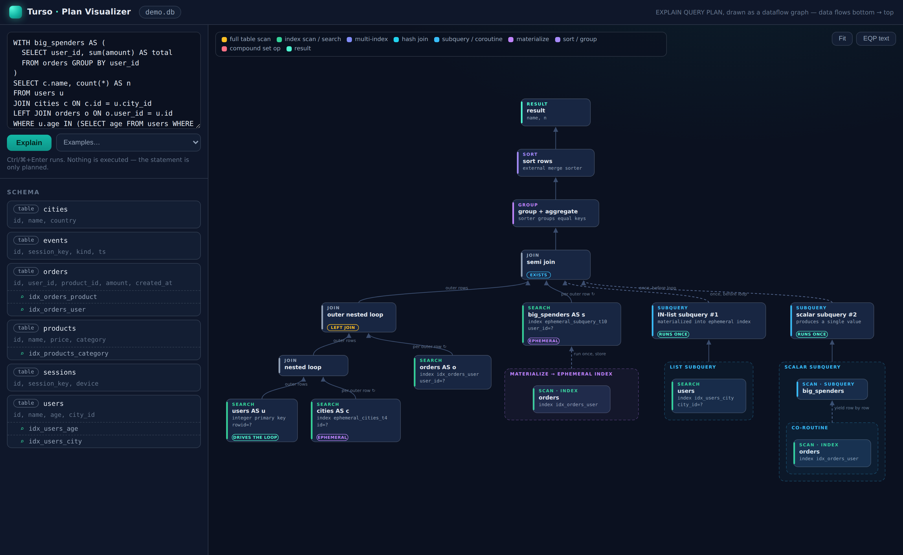
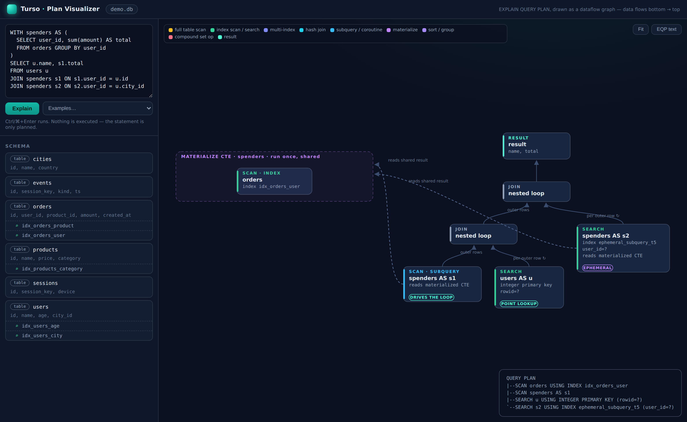
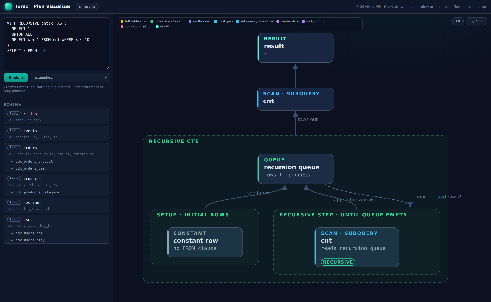
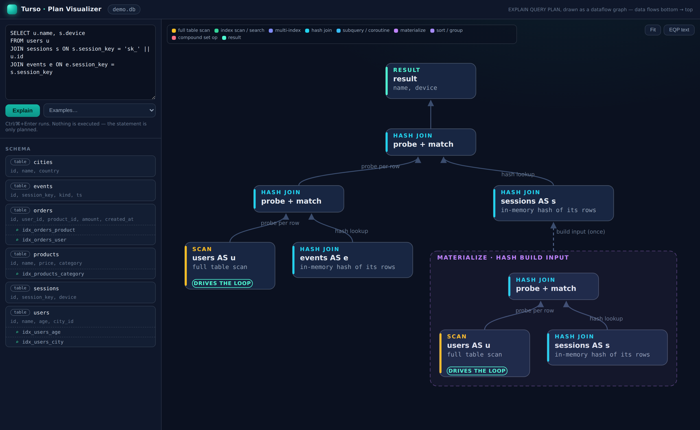
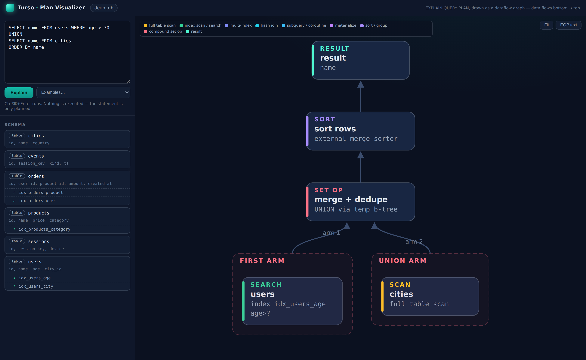
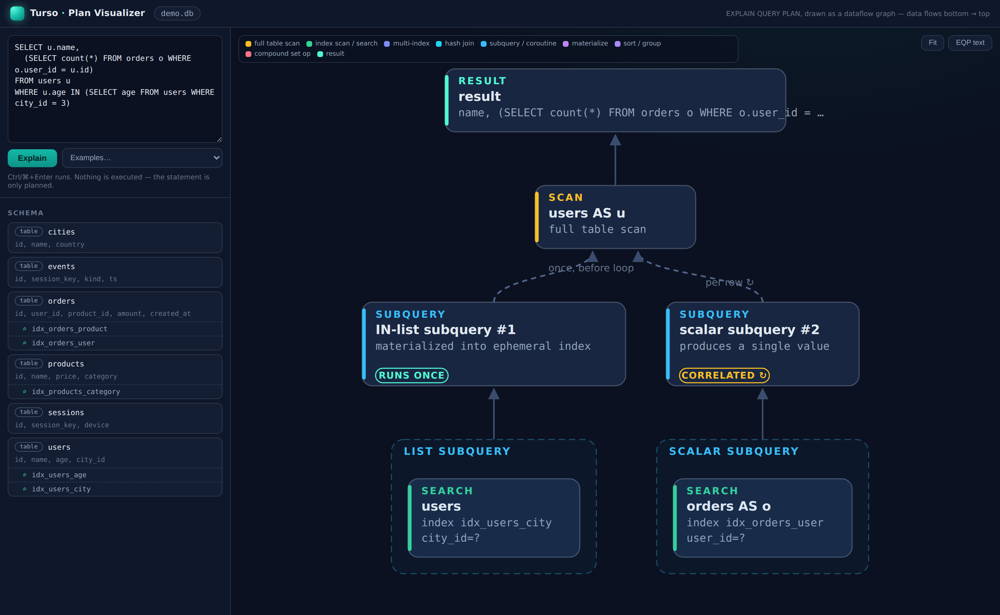
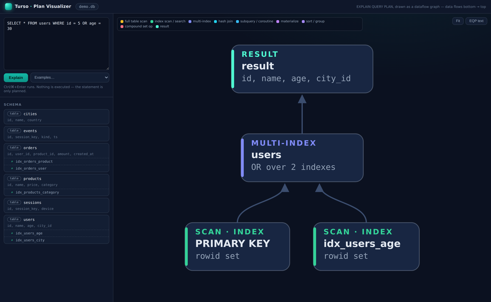
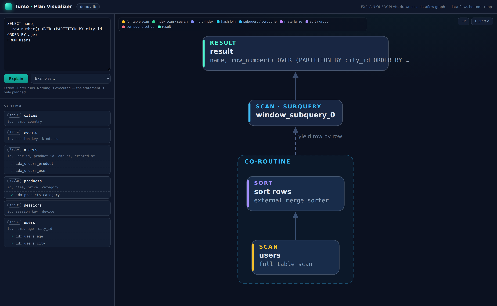

# Query Plan Visualizer

Turso can show `EXPLAIN QUERY PLAN` output as an interactive dataflow graph,
similar to MySQL Workbench's Visual Explain or pgexplain.dev:

```console
$ tursodb my.db --planviz 127.0.0.1:8080
Turso plan visualizer for my.db
Open http://127.0.0.1:8080/ in your browser. Press Ctrl+C to stop.
```



Type a query and press **Explain** (or Ctrl+Enter). The statement is only
prepared, never executed, so exploring plans — including for
`INSERT`/`UPDATE`/`DELETE` — cannot change the database. Data flows from the
bottom of the graph to the `RESULT` node at the top. Nested-loop joins fold
into join operator nodes, coroutine and materialized subqueries render as
containers feeding their reader, and dashed edges mark work that runs once
(hash builds, uncorrelated subqueries, shared CTE materializations) or once
per row (correlated subqueries). Click any node to see its raw plan fields;
the **EQP text** button shows the classic text tree for comparison.

The page can be deep-linked: `http://127.0.0.1:8080/#sql=<url-encoded SQL>`
runs the query on load.

## Machine-readable plans

The visualizer is built on a machine-readable form of `EXPLAIN QUERY PLAN`.
Parsing the human-readable detail strings ("SCAN users USING COVERING INDEX
...") is brittle, so every plan step now carries structured data alongside the
string, exposed two ways:

- **Rust API**: prepare a statement as `EXPLAIN QUERY PLAN <stmt>` and call
  [`Statement::query_plan_json`]. Returns `None` for statements not prepared
  in EXPLAIN QUERY PLAN mode. No stepping needed — the plan is fully known
  after preparation.
- **HTTP**: `POST /plan` on the visualizer server with `{"sql": "SELECT ..."}`
  returns the same JSON (any `EXPLAIN` prefix in the SQL is ignored).

The JSON looks like:

```json
{
  "version": 1,
  "sql": "EXPLAIN QUERY PLAN SELECT ...",
  "result_columns": ["name", "amount"],
  "nodes": [
    {
      "id": 2,
      "parent": null,
      "detail": "SEARCH o USING INDEX idx_orders_user (user_id=?) LEFT-JOIN",
      "op": {
        "type": "search",
        "table": "orders",
        "alias": "o",
        "join": "left",
        "search_kind": "seek",
        "index": {"name": "idx_orders_user", "covering": false, "ephemeral": false},
        "constraints": ["user_id=?"]
      }
    }
  ],
  "cte_materializations": [{"cte_id": 1, "name": "spenders", "nodes": [4, 7]}]
}
```

`nodes` lists the same rows `EXPLAIN QUERY PLAN` prints, in the same order:
`id`/`parent` encode the tree (`parent: null` marks a root) and `detail` is
the exact display string. `op` adds the structured fields, discriminated by
`op.type`:

| `op.type` | Meaning | Extra fields |
|---|---|---|
| `scan` | iterate a row source | `table`, `alias?`, `source` (`table`/`virtual_table`/`subquery`/`recursive_cte_input`), `index?` , `backwards?`, `join?`, `subquery?` |
| `search` | seek by key | `table`, `alias?`, `search_kind` (`rowid_eq`/`seek`/`in_seek`), `index?` or `integer_primary_key`, `constraints`, `backwards?`, `join?`, `subquery?` |
| `multi_index` | combine rowid sets from several indexes | `set_op` (`or`/`and`), `indexes` |
| `index_method` | pluggable index method access | `method` |
| `hash_join` | hash side of a hash join | `table`, `alias?`, `join?`, `subquery?` |
| `hash_build` | materialize a hash join's build input | `table`, `alias?` |
| `distinct` / `distinct_aggregate` | hash-table de-duplication | `function` (aggregate only) |
| `order_by` / `group_by` | sorting stage | `method` (`sorter`/`temp_btree`) |
| `compound` / `compound_arm` | compound select and its arms | `op` (`union_all`/`union`/`intersect`/`except`/`left_most`), `temp_btree` |
| `list_subquery` / `scalar_subquery` | `IN (SELECT ...)` / scalar subquery | `subquery_id`, `correlated` |
| `recursive_setup` / `recursive_step` | recursive CTE phases | |
| `constant_row` | query with no FROM clause | |

Fields that are absent are simply omitted (e.g. `join` on the first table,
`index` on a rowid search). Notable structured-only information that the text
output does not show:

- `join`: how the table participates in the join — `inner`, `cross`, `left`,
  `full`, and crucially `semi` / `anti` for `EXISTS` / `NOT EXISTS` rewrites,
  which are indistinguishable from inner joins in the text output.
- `subquery` on scans/searches of FROM-clause subqueries:
  `{"execution": "coroutine" | "materialized" | "indexed_materialized" |
  "materialized_reuse", "cte_id": n, "recursive": true}`. `cte_id` links every
  reader of a shared CTE to the same materialization.
- `cte_materializations`: shared CTEs that are materialized before the main
  query runs. Their plan nodes appear at the root level of the tree; this
  side channel groups them and names the CTE so tools can draw them as one
  unit.
- `backwards` scans, `covering`/`ephemeral` index flags, and the seek
  constraint list as an array instead of a parenthesized string.

## Interesting plans, visualized

A CTE referenced twice: materialized once, with both readers linked to the
shared result — and the flat text tree for contrast (bottom right):



A recursive CTE: SETUP seeds the recursion queue, RECURSIVE STEP consumes and
refills it:



A three-way join the optimizer runs as chained hash joins, including the
materialized build input:



`UNION` with its per-arm subplans and the dedupe merge:



Correlated scalar subqueries (run per row) vs. uncorrelated `IN`-list
subqueries (run once, before the loop):



`OR` across two indexes via a multi-index scan:



A window function's implicit coroutine subquery with its sorter:


