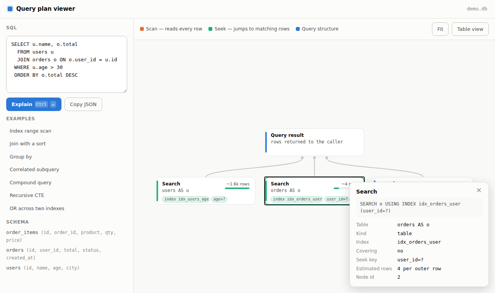
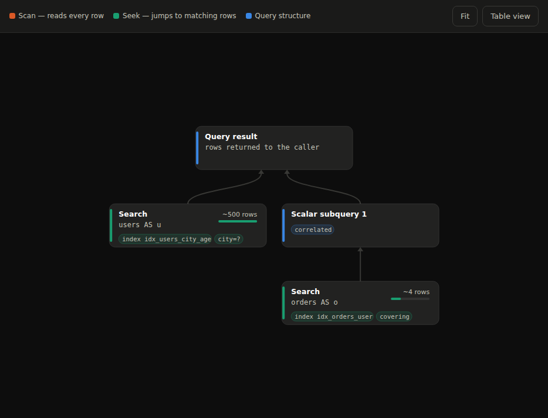
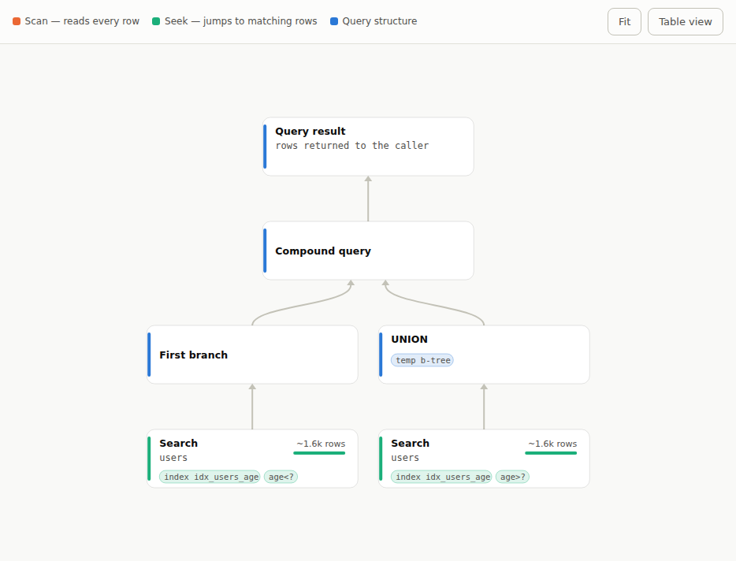
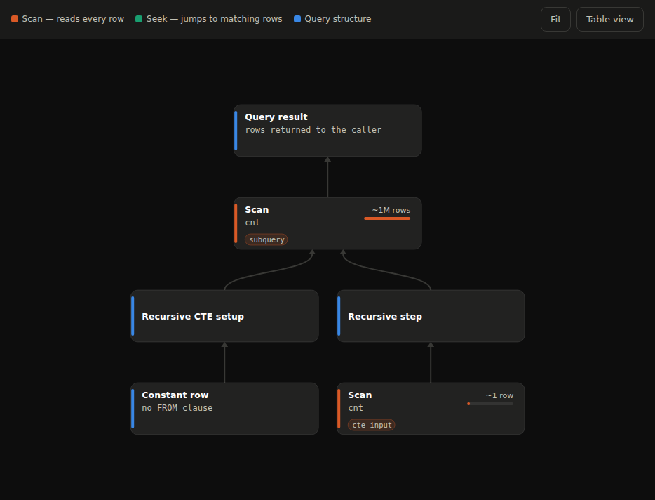
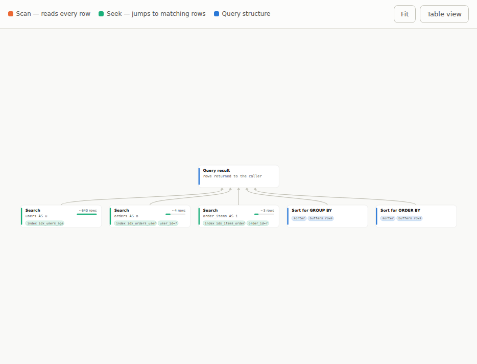
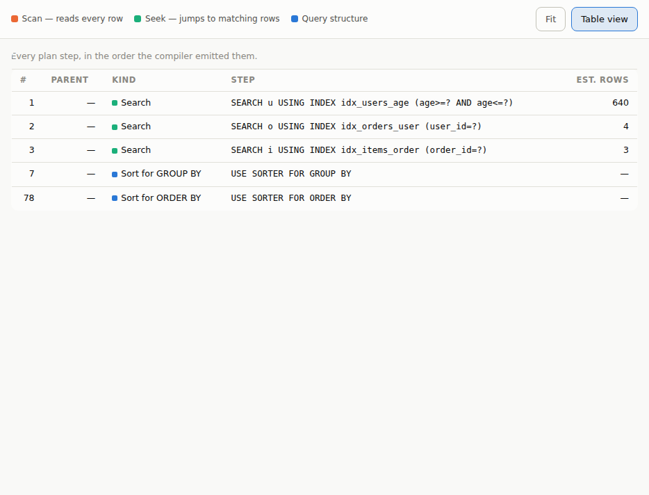

# Query plan viewer

Turso can export a query plan as JSON and draw it as a diagram, so you can see
what the planner decided without reading `EXPLAIN QUERY PLAN` output line by
line.

```bash
tursodb mydb.db --explain-server        # viewer on http://127.0.0.1:8375/
```

```
turso> .plan SELECT * FROM users WHERE age > 30
```

The full reference — every JSON field, every node kind, the flags — is in the
CLI manual:

```
turso> .manual query-plan
```

## What the diagram shows

Plans are drawn bottom-up. Steps that read rows sit at the bottom, arrows
follow the rows into the steps that consume them, and the query result is on
top. Click a node for its detail; drag to pan and scroll to zoom.

Nodes are colored by what they do — an orange scan reads every row, a green
seek jumps straight to the matching rows, and blue marks a step that shapes the
query. Each node also names its own kind, so the color never carries the
meaning alone.



The bar beside each row estimate compares that step against the largest
estimate in the same plan, which makes the expensive end of a join order easy
to spot.

## Nesting is where it pays off

A correlated subquery is a subtree, and the diagram says so — including that it
re-runs for every outer row:



Compound queries branch:



And a recursive CTE shows its setup and its recursive step feeding the same
scan:



A wider join fans in:



## Table view

The same plan as text, for copying into an issue or reading with a screen
reader:



## Where the data comes from

The compiler builds a structured node for every plan step, and the
`EXPLAIN QUERY PLAN` text is rendered from those nodes. The JSON is the same
tree with the fields still separate, so a tool never has to parse the English
back apart, and the two cannot drift.

- `Connection::query_plan(sql)` returns the plan for a statement.
- `Statement::query_plan()` returns it for a statement already prepared as
  `EXPLAIN QUERY PLAN`.
- `QueryPlan::to_json()` serializes it.

The server is a development tool: it binds to loopback, handles one request at
a time, and only ever compiles the SQL it is given. Do not put it on a public
address.
